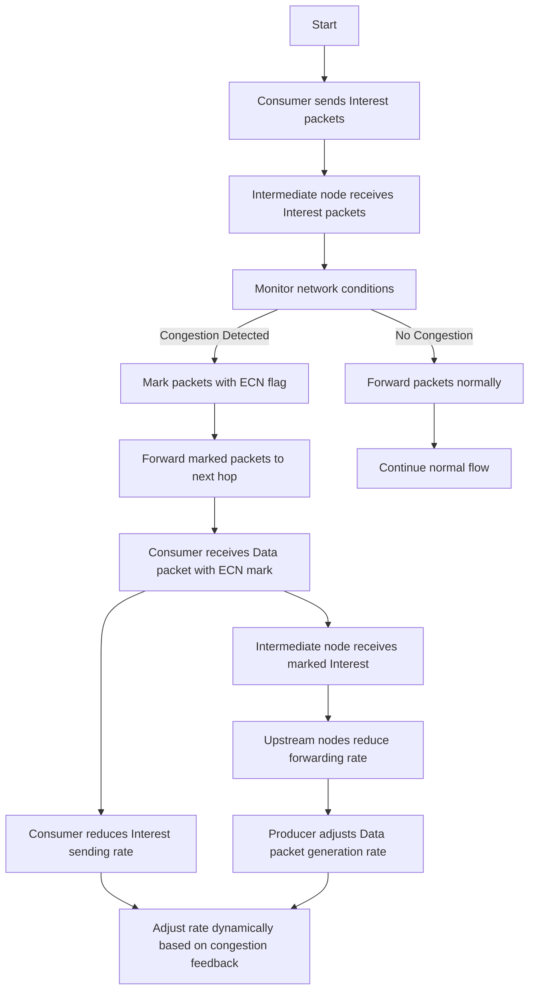

# ndn-cc
ECN Based Congetion Control Algorithm for NDN
## Algorithm

```mermaid
flowchart TD
    A[Start] --> B[Consumer sends Interest packets]
    B --> C[Intermediate node receives Interest packets]
    C --> D[Monitor network conditions]
    D -->|Congestion Detected| E[Mark packets with ECN flag]
    D -->|No Congestion| F[Forward packets normally]
    E --> G[Forward marked packets to next hop]
    G --> H[Consumer receives Data packet with ECN mark]
    H --> I[Consumer reduces Interest sending rate]
    I --> J[Adjust rate dynamically based on congestion feedback]
    F --> K[Continue normal flow]

    H --> L[Intermediate node receives marked Interest]
    L --> M[Upstream nodes reduce forwarding rate]
    M --> N[Producer adjusts Data packet generation rate]
    N --> J

```
